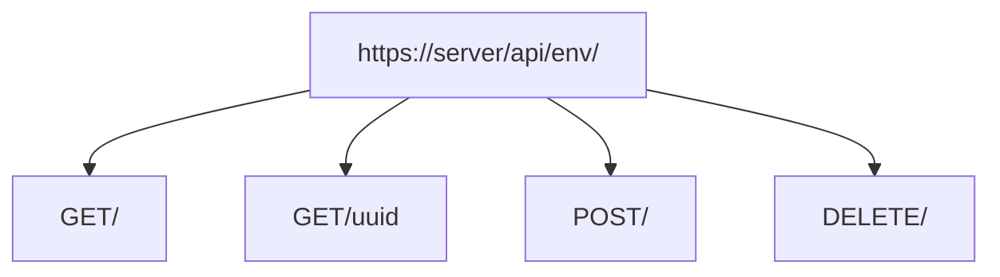
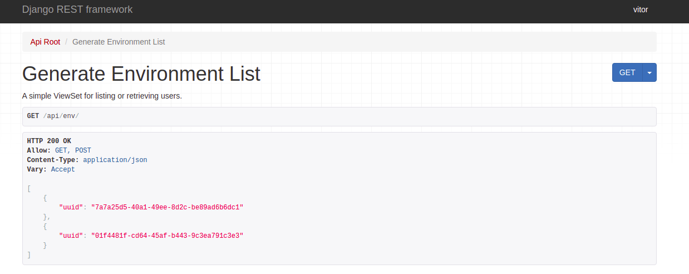
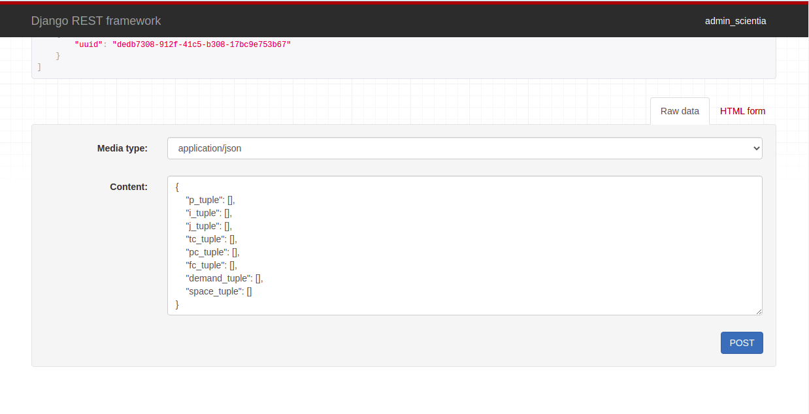
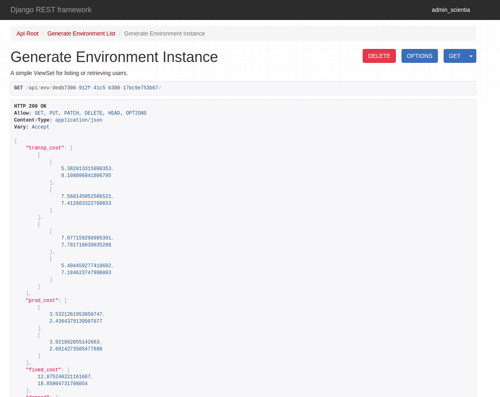

# Environment API Documentation
Returns all environment from a registered account.



---

## ```Get```
### endpoint: ``` /env/ ```

Returns  Environments registered on the database.

#### Parameters
No parameters.

#### Responses

| Code        | Description      |  
| ----------- | ---------------- |
| `200`       |  Success         | 
| `400`       |  Bad Request     | 
| `401`       |  Not Authorized  | 

Example:

```JSON
GET http://server/api/env/

Response 200 ok
[
 {"uuid":  "string"}
 {"uuid":  "string"}
 {"uuid":  "string"}
]
```
##### Consuming the API
1. Enter in the url [http://server/api/env/](http://18.216.21.236:8000/api/env/)
1. Click on `GET` button at the top right side of the screen
1. Make sure you are logged in.



---

### endpoint: ```/env/{uuid} ```

Returns  Environments registered on the database.

#### Parameters
| Parameter    | In            | Description          |
| ------------ | ------------- | -------------------- |
| uuid  *required       | path          | Environment identifier |

#### Responses

| Code        | Description      |  
| ----------- | ---------------- |
| `200`       |  Success         | 
| `400`       |  Bad Request     | 
| `401`       |  Not Authorized  | 

    

Example:

```JSON
GET http://server/api/env/uuid
        
Response
200 ok
{
    "transp_cost": [
        [
            [
                8.504379284263033,
                8.21952272694995,
                7.335616371598338
            ],
            [
                9.188171808943858,
                6.399709100195715,
                8.465899755878109
            ],
            [
                5.043810632924408,
                9.30498145274223,
                5.543619294516228
            ]
        ],
        [
            [
                8.273912408515342,
                5.219330242553533,
                6.965109393725479
            ],
            [
                6.843241536238311,
                8.861599481023948,
                5.229627303652337
            ],
            [
                5.757278568029695,
                9.556365124630641,
                5.645263721660658
            ]
        ]
    ],
    "prod_cost": [
        [
            2.6673777707712727,
            2.019097743991032,
            3.9197012389507133
        ],
        [
            4.028668653602703,
            4.930122930206867,
            2.669597812493785
        ]
    ],
    "fixed_cost": [
        17.61564249593163,
        13.014259072860215,
        19.19574948645142
    ],
    "demand": [
        [
            24,
            17,
            24
        ],
        [
            14,
            24,
            10
        ]
    ],
    "supply": [
        [
            29.0,
            25.0,
            26.0
        ],
        [
            21.0,
            21.0,
            19.0
        ]
    ],
    "space": [
        1.0127012901645935,
        1.1174345954454479
    ],
    "flow_cap": [
        [
            25.0,
            26.0,
            27.0
        ],
        [
            25.0,
            23.0,
            25.0
        ],
        [
            22.0,
            24.0,
            20.0
        ]
    ],
    "uuid": "01f4481f-cd64-45af-b443-9c3ea791c3e3",
    "p_tuple": [
        2.0,
        5.0
    ],
    "i_tuple": [
        2.0,
        5.0
    ],
    "j_tuple": [
        2.0,
        5.0
    ],
    "tc_tuple": [
        5.0,
        10.0
    ],
    "pc_tuple": [
        2.0,
        5.0
    ],
    "fc_tuple": [
        10.0,
        20.0
    ],
    "demand_tuple": [
        10.0,
        25.0
    ],
    "space_tuple": [
        0.25,
        1.5
    ],
    "num_p": 2,
    "num_i": 2,
    "num_j": 4
}
```

##### Consuming the API
1. Enter the url [http://server/api/env/uuid](http://18.216.21.236:8000/api/env/), where uuid was provided by the previous step.
3. Make sure you are logged in.

!!! warning
    Note that if uuid is invalid, bad request will return.


---

## ```Post```
### endpoint: ``` /env/ ```

Create a new Environment instance from a given json.

#### Parameters
| Parameter                 | In            | Description            |
| ------------              | ------------- | --------------------   |
| p_tuple  *required        | body          | Array of integers      |
| i_tuple  *required        | body          | Array of integers   |
| j_tuple  *required        | body          | Environment identifier |
| tc_tuple  *required       | body          | Environment identifier |
| pc_tuple  *required       | body          | Environment identifier |
| fc_tuple  *required       | body          | Environment identifier |
| demand_tuple  *required   | body          | Environment identifier |
| space_tuple  *required    | body          | Environment identifier |


#### Responses

| Code        | Description      |  
| ----------- | ---------------- |
| `200`       |  Success         | 
| `400`       |  Bad Request     | 
| `401`       |  Not Authorized  | 

Example:

```JSON
POST http://server/api/env/

Request body
{
    "p_tuple": [2, 5],
    "i_tuple": [2, 5],
    "j_tuple": [2, 5],
    "tc_tuple": [5, 10],
    "pc_tuple": [2, 5],
    "fc_tuple": [10, 20],
    "demand_tuple": [2, 5],
    "space_tuple": [0.25, 1.5]
}

Response 
200 ok
HTTP 200 OK
Allow: GET, POST, HEAD, OPTIONS
Content-Type: application/json
Vary: Accept

{
    "uuid": "dedb7308-912f-41c5-b308-17bc9e753b67",
    "p_tuple": [
        2.0,
        5.0
    ],
    "i_tuple": [
        2.0,
        5.0
    ],
    "j_tuple": [
        2.0,
        5.0
    ],
    "tc_tuple": [
        5.0,
        10.0
    ],
    "pc_tuple": [
        2.0,
        5.0
    ],
    "fc_tuple": [
        10.0,
        20.0
    ],
    "demand_tuple": [
        2.0,
        5.0
    ],
    "space_tuple": [
        0.25,
        1.5
    ],
    "num_p": null,
    "num_i": null,
    "num_j": null
}
```
##### Consuming the API
1. Enter in the url [http://server/api/env/](http://18.216.21.236:8000/api/env/)
1. Fill the form at the bottom of the screen, using  parameters specification above.
1. Click on `POST` button at the bottom right side of the screen


---

## ```Delete```
### endpoint: ``` /env/ ```

Delete an Environment instance from a given uuid.

#### Parameters
| Parameter    | In            | Description          |
| ------------ | ------------- | -------------------- |
| uuid  *required       | path          | Environment identifier |


#### Responses

| Code        | Description      |  
| ----------- | ---------------- |
| `200`       |  Success         | 
| `400`       |  Bad Request     | 
| `401`       |  Not Authorized  | 

Example:

```JSON
DELETE http://server/api/env/uuid

Response 
HTTP 200 OK
Allow: GET, PUT, PATCH, DELETE, HEAD, OPTIONS
Content-Type: application/json
Vary: Accept

}
```
##### Consuming the API
1. Enter the url [http://server/api/env/uuid](http://18.216.21.236:8000/api/env/),
where uuid was provided by the previous step.

2. Click on `DELETE` on the right top side of the screen.


---