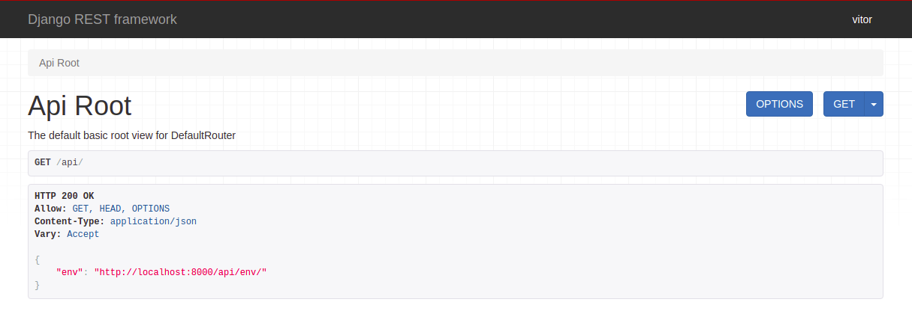

# Quick Start

Welcome to quick start documentation.

## Api's
To acess the terminal for interative tests for the api's,
enter in the api root

- [Environment Api Documentation](./endpoints.md)

## Accessing the EndPoints
All endpoints avaiable are listed in [server](http://18.216.21.236:8000/api/)
When entering in this url, all endpoints will be listed.

!!! note
    You need toe loged in to use the API's

Example: 
1. To login access the [admin page](http://localhost:8000/admin/)

   2. username: your username.
   
   3. password: your password.
   
3. enter at [server](http://18.216.21.236:8000/api/) and it's done. Start to use the api!

