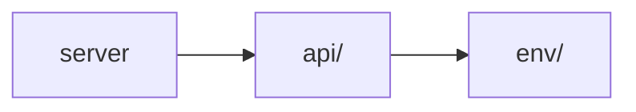

# Scientia APIs 
#### `1.0.0`  `OAS3`

Welcome to the Scientia APIs Documentation.

[Testing Environment](http://18.216.21.236:8000/api/)

[Contact the developer](#)

[Find out more about Scientia Dev documentation](#)

##### Servers:
-  [http://18.216.21.236:8000/api/](http://18.216.21.236:8000/api/)

##### Infrastructure

## APIs

*  [Quick Start](./apis/index.md)
*  [Environment API](./apis/endpoints.md)
*  [Authentication API](./apis/auth.md)

## Project layout

* Check for the full project at [https://github.com/vitorvendrami/scientia](https://github.com/vitorvendrami/scientia)